<p align="center">
  
</p>

<h1 align="center">晷迹 · Noonmark</h1>

<p align="center">
  <strong>把任务的今天、来路与去向都留下来。</strong><br>
  面向 macOS 的原生、local-first 日任务系统，围绕 Day Todo、任务轨迹、每日复盘和可解释 AI 协作设计。
</p>

<p align="center">
  <a href="#产品导览">产品导览</a> ·
  <a href="#核心能力">核心能力</a> ·
  <a href="#系统设计">系统设计</a> ·
  <a href="#本地构建">本地构建</a> ·
  <a href="#质量门禁">质量门禁</a>
</p>

<p align="center">
  
  
  
  
</p>

## 晷迹解决什么问题

普通 Todo 擅长回答“现在还有什么没打勾”，却很难如实回答：

- 星期一没完成、星期二继续后，星期一到底发生了什么；
- 主动延期、日终未完成、任务变更和回到任务池是否应该是同一种状态；
- 一项长期重复计划的规则、每天实例和历史完成情况怎样同时成立；
- AI 为什么读到这些任务、给出了什么建议，又真正改写了什么；
- 多设备交换数据时，怎样避免旧事实复活或静默覆盖当前状态。

晷迹把“当前计划”和“已经发生的事实”分开。`TaskChain` 记录同一件事的连续身份，`TaskDefinition` 记录当前描述与计划，`DayTrace` 记录某个自然日真实发生的结果。页面不是几张互不相干的清单，而是同一组领域事实的不同投影。

| 产品原则 | 在晷迹里的落点 |
| --- | --- |
| Day-first | 每个自然日都有独立 Day Todo、真实结果与每日复盘 |
| 历史不说谎 | 完成、未完成、延期、回池、变更和废弃保留不同语义 |
| 计划与执行分离 | 任务池、未来计划、重复计划与具体日实例各司其职 |
| 本地优先 | 核心 Todo 以本机 SQLite 为事实源，无账号、无网络也可工作 |
| 白盒 AI | 烛龙披露读取范围、接收方、产物、确认和应用回执 |
| 失败可见 | 数据、同步和 Provider 路径 fail-closed，不用静默成功掩盖问题 |

## 产品导览

以下画面全部来自同一个真实 `NoonmarkDemo.app`：固定一年用户故事通过正式领域接口重放，再由 SQLite 与加密烛龙 sidecar 回读对账。它们不是 HTML 原型，也不是为 README 手工拼出的静态 mock。

主工作区的八个一级界面、快速记录和四个不包含宿主机身份信息的设置界面均在下方逐一完整展示。同步与 Provider 设置可能包含本机路径或 Provider 身份，因此不生成可复用文档截图，继续由专用真实 App E2E 验证。

### 计划与执行

#### Day Todo：一天的计划与结果

日期导航、快速输入、置顶队列、分组任务、重复实例和当日结果都在同一条日轨迹上。右侧每日复盘同时呈现完成率、近七天趋势、本地信号、总结和未完成原因，不需要切换到另一套数据视图。

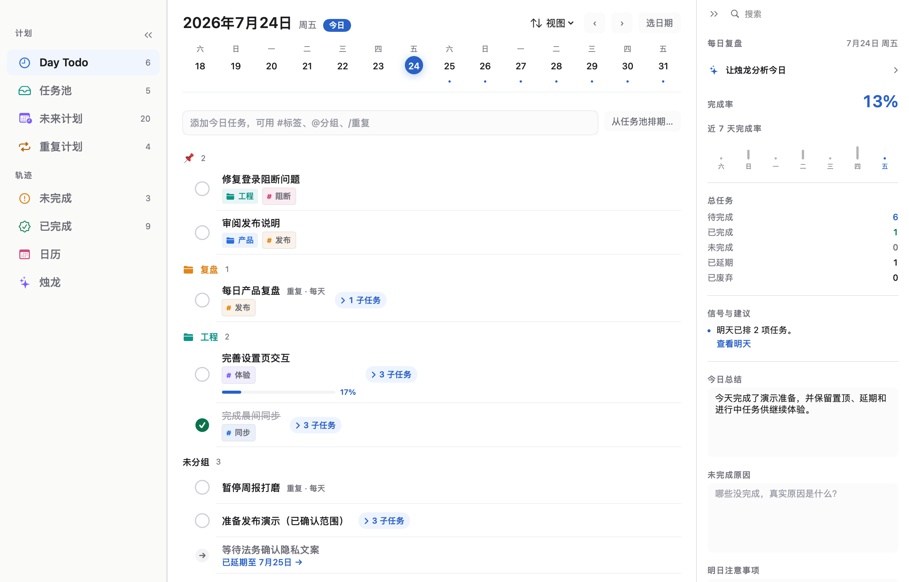

#### 任务池：先捕获，再决定日期

任务可以直接进入今天，也可以先留在任务池。标题输入支持 `#标签`、`@分组`，并可用 `/重复` 或 `/repeat` 进入重复计划配置。任务池按分组整理尚未承诺日期的事项，右侧提供不依赖 Provider 的本地统计；Provider 就绪时才显示有证据、可复核的烛龙分析。

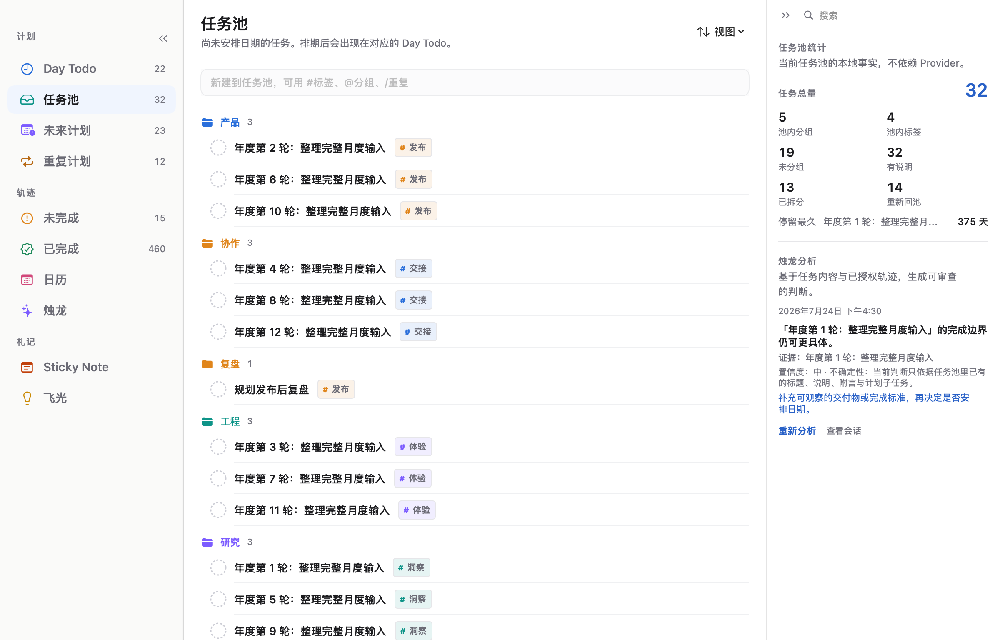

#### 未来计划：按日看承诺与负载

普通任务和重复实例按日期汇合，仍保留各自的分类与来源。重复实例可以切换未来 7／15／30 天可见范围；右栏汇总覆盖日期、最重负载日、本地信号和可执行建议。

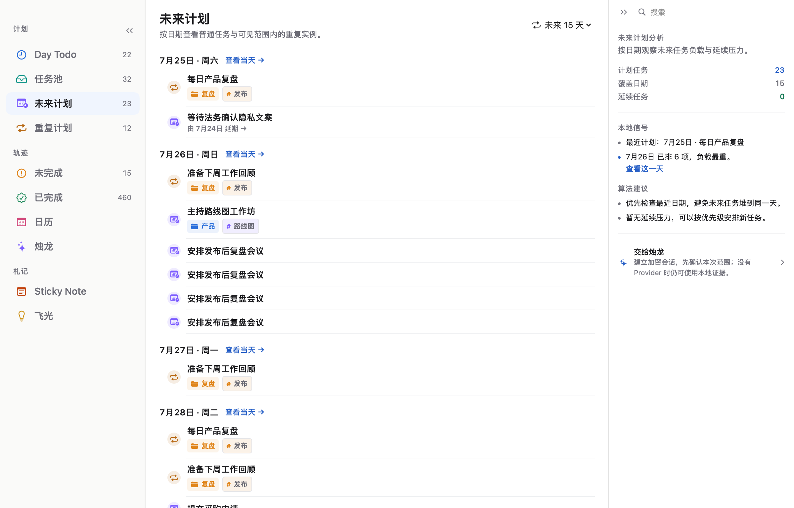

#### 重复计划：规则与每日事实分开

重复计划不是在普通列表里无限复制同名任务。父计划集中管理标题、说明、分类、标签、子任务、开始日期、频率、结束条件和向前生效的修订；每个计划日仍形成可独立完成、未完成、延期、跳过或废弃的实例。

进行中、即将开始、自然结束和提前停止拥有不同生命周期语义。展开轨迹后可以逐日检查发生过的事实，不用“连续几天”这一项摘要替代真实记录。

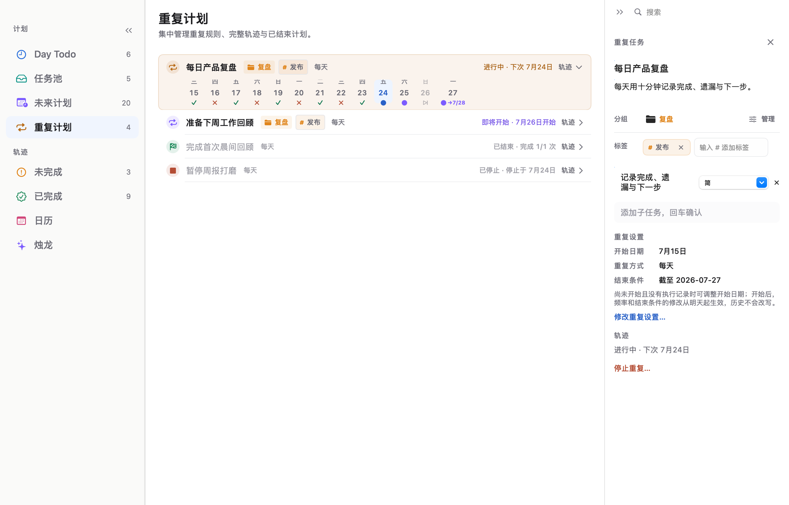

### 轨迹与复盘

#### 未完成：延续之前先看清来路

未完成池按任务链去重，直接显示未完成次数、延续次数和最近未完成日期。用户可以展开明细，再决定延续或明确废弃；页面右栏同时汇总重复风险、本地信号和处理建议。

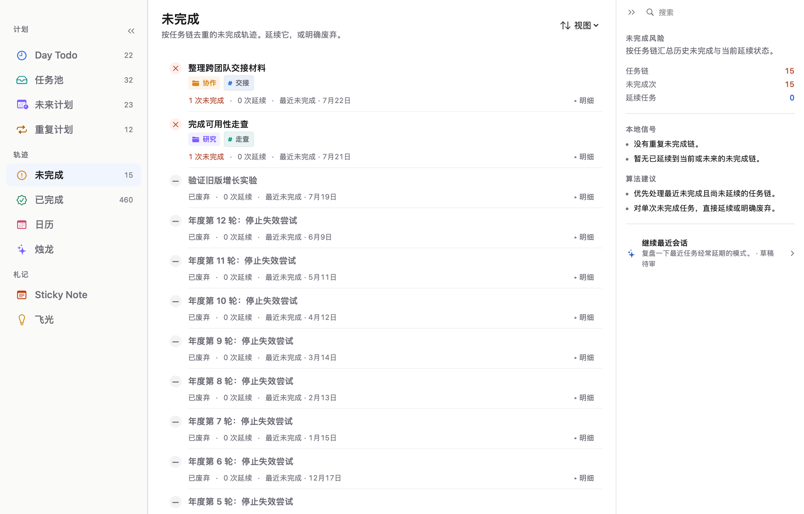

#### 已完成：保留层级与跨日轨迹

已完成池按完成事实展示单日与跨日轨迹，并用缩进结构表达父子任务关系。部分完成与完整完成使用不同的父子层级，完成时间和可复制的推进路径不会被压扁成一排标题。

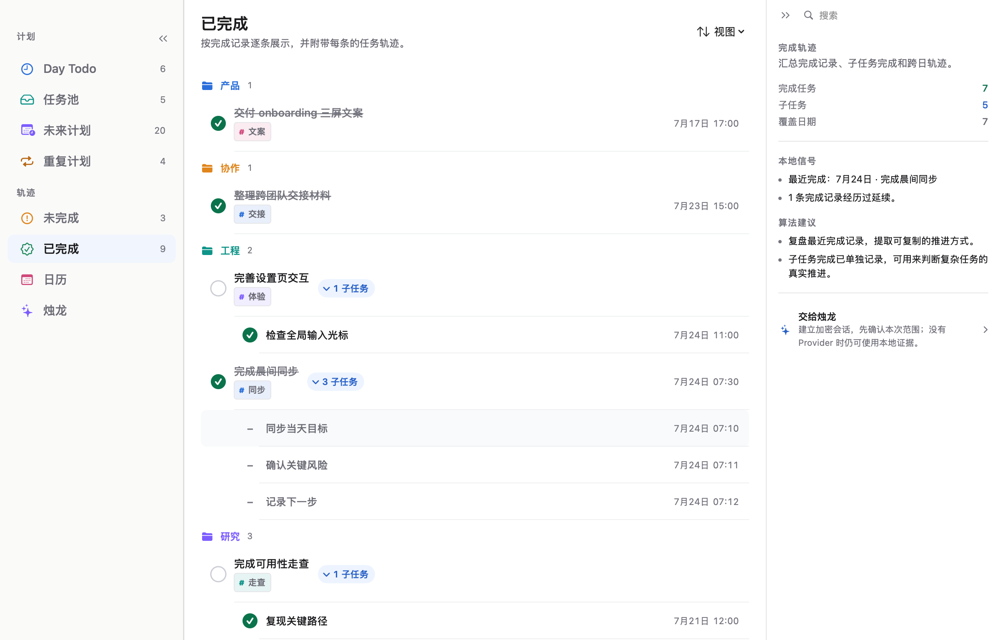

#### 日历：按月回看普通任务轨迹

日历按月汇总普通任务的日期、状态和摘要；选择某一天后可以回到该日真实 Day Todo。重复计划的父项与管理轨迹留在“重复计划”，日历只承担普通日轨迹总览，避免跨模块重复计数。

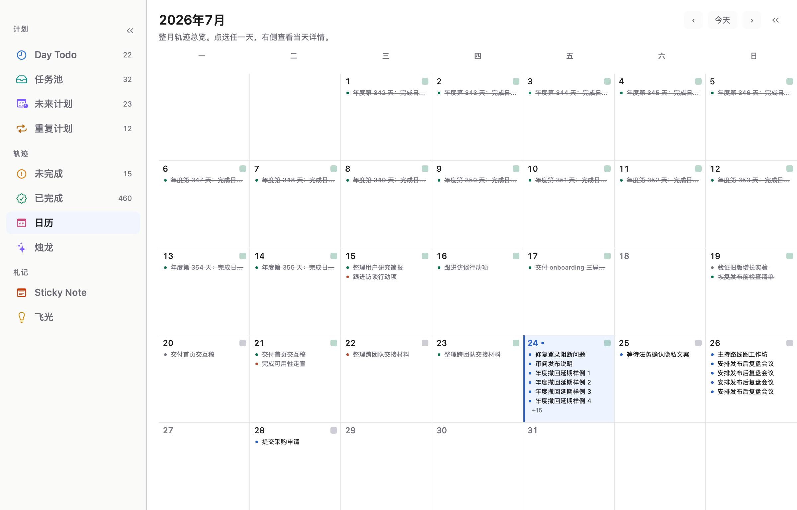

### 可解释 AI 协作

#### 烛龙：会对话，但不绕过任务边界

烛龙可以协助任务成形、每日复盘、习惯洞察和任务池分析。Provider 只接收用户授权的范围；结构化产物先形成可审阅 artifact 与 Todo diff，再由用户确认后通过普通领域接口应用。唯一的窄自动写入例外是用户显式启用的新任务自动分组与标签，它由耐久 job、严格响应 contract 和过期 fences 约束。

没有 Provider 时，Day Todo、任务池、未来计划、重复计划、日历、数据包和本地统计仍然完整可用。

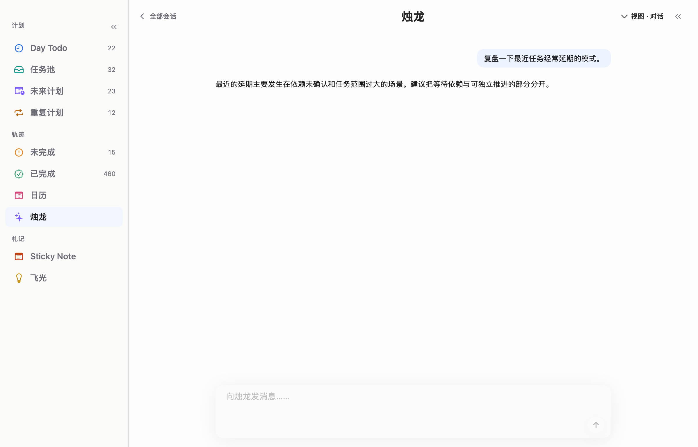

### 捕获、组织与数据边界

#### 在任何 App 里快速记录

应用内使用 `⌘N`；晷迹进程运行时，还可以用默认 `⌃⇧N` 从其他 App 唤起独立 Quick Entry。全局组合可录制修改，注册失败时保留旧组合，并明确提示 macOS 无法枚举所有第三方 App 快捷键这一系统边界。

<p align="center">
  
</p>

#### 偏好与全局快捷键

偏好设置集中管理亮色外观、中文／English、Day Todo 与日历共用的滑动方向、全局快速记录组合，以及可选的设置页诗文。

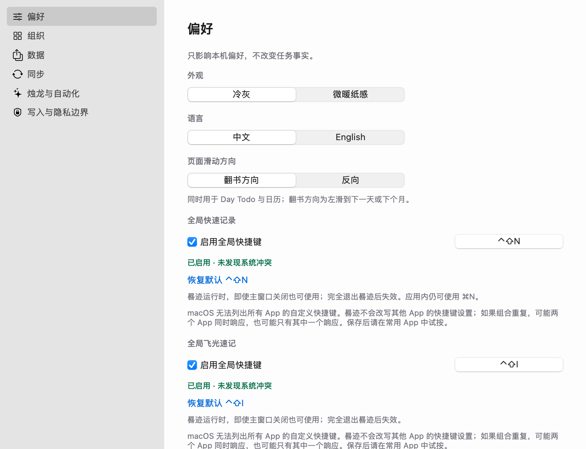

#### 分组与标签目录

一个主分组建立稳定结构，多标签补充横向线索。组织设置显示当前目录规模，并进入统一的分组与标签管理界面。

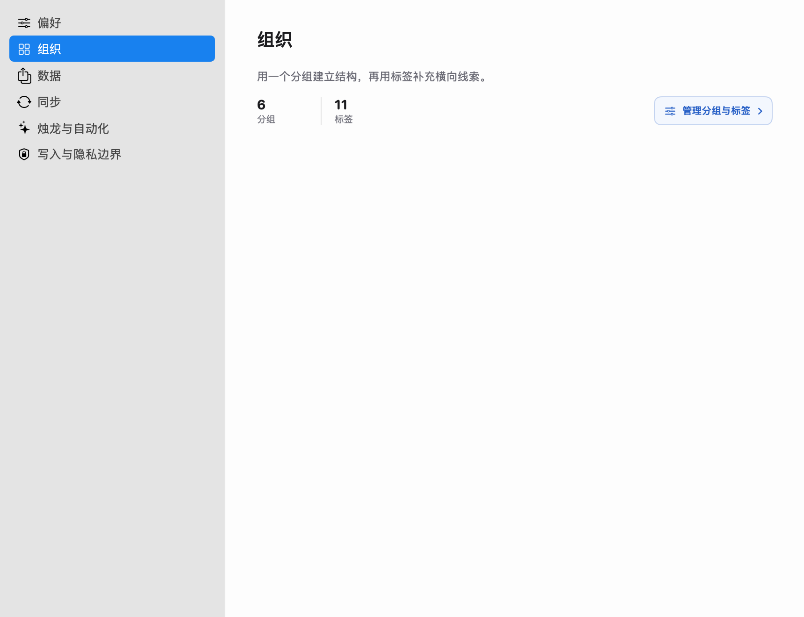

#### 事务性数据包

数据设置通过 canonical JSON 数据包导出与导入完整任务事实。导入先校验、再事务性替换，失败时回滚，不把半套数据留在当前数据库。

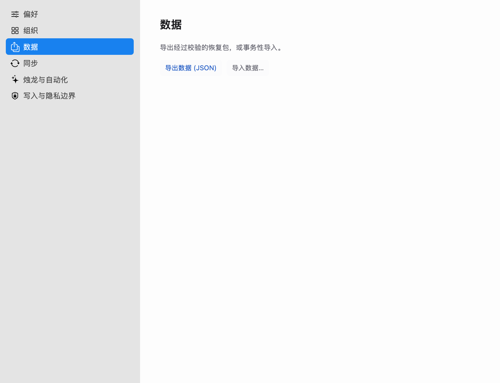

#### 写入与隐私边界

隐私设置明确列出 Provider 请求、远程发送范围、Todo 写入确认和失败行为。API Key 留在 Keychain，数据库文件、内部 ID 和同步端点配置不会发送给 Provider。

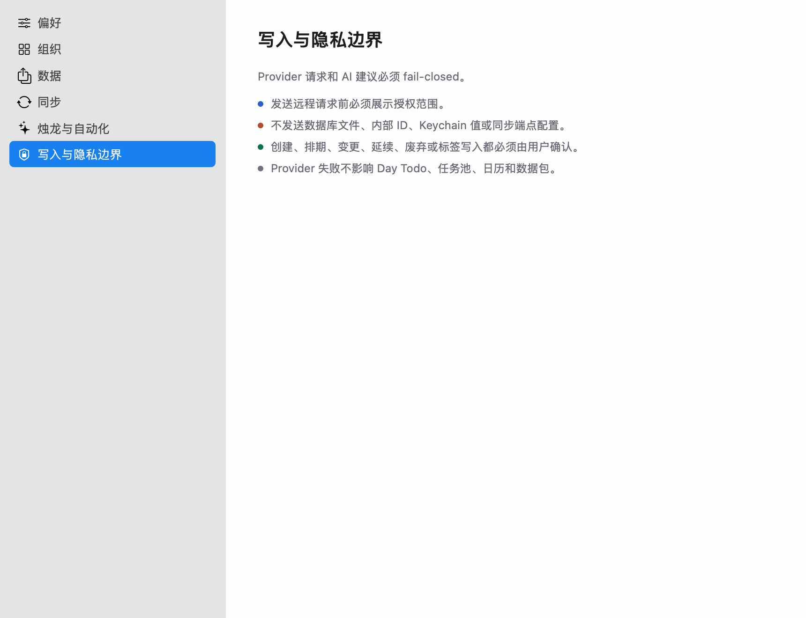

## 核心能力

| 领域 | 已实现能力 |
| --- | --- |
| Day Todo | 快速新增、置顶、完成、延期、回池、变更、废弃、进度、子任务、附言、每日复盘 |
| 任务池 | 未排期任务、说明、计划子任务、排期、分组视图、本地统计、grounded 烛龙分析 |
| 未来计划 | 普通任务改期、按日期聚合、重复实例 7／15／30 天可见范围 |
| 重复计划 | 四态生命周期、有限结束条件、向前修订、停止、跳过、完整逐日轨迹 |
| 历史池 | 未完成按任务链聚合；已完成保留时刻、轨迹和父子层级 |
| 分类 | 一个主分组、多标签、历史快照；任何任务状态都可整理当前分类 |
| 捕获与导航 | 应用内 `⌘N`、全局快捷键、原生菜单、搜索、日期键盘导航与滑动 |
| 数据 | SQLite、canonical JSON 数据包、写后回读、事务性导入与失败回滚 |
| 同步 | 显式启用的 iCloud Drive／本地文件夹逐记录同步、冲突与等待状态、真实任务变化计数、最近同步与最近有效同步时间 |
| AI | OpenAI-compatible／本地／自定义 HTTP Provider seam、连接测试、流式会话、结构化产物、授权与回执 |
| 国际化与外观 | 中文／English、冷灰／微暖纸感、macOS 原生亮色界面 |

> 同步边界：S3 与 WebDAV 目前仍是规划中的端点；CloudKit `CKSyncEngine` adapter 已有实现边界，但在 provisioning、Production schema 和双物理设备 live 门禁完成前不作为默认用户路径。当前可用的 Apple 云路径是显式启用的 iCloud Drive 逐记录仓库。

## 数据、隐私与 AI 边界

| 数据层 | 保存位置与保护 | 默认边界 |
| --- | --- | --- |
| 核心 Todo 事实 | 本机 SQLite | local-first 主事实源；不依赖 Provider |
| Provider API Key | macOS Keychain | 不进入 SQLite、数据包或同步记录 |
| 烛龙会话与产物 | 独立 AES-GCM 加密 sidecar | 普通 Todo 数据包与同步不包含 sidecar |
| 数据包 | canonical JSON + SHA-256 回读校验 | 文件本身不加密；导入时事务性替换并保持同步关闭 |
| 同步仓库 | 逐条 canonical `SyncRecord` | 不复制 SQLite／WAL／SHM；合并前按不可信输入校验 |
| Provider 请求 | 用户授权的最小 scope | 不发送数据库文件、内部 ID、Keychain 值或同步端点配置 |

AI 的读取授权、远程发送授权和 Todo 写入授权彼此分离。接收方、范围或 endpoint 实质变化会触发重新确认；Provider 失败不会阻断普通清单，错误也不能被记录成成功。

## 系统设计

晷迹是 Apple-first 的 SwiftPM 模块化单体：AppKit 管理应用生命周期、窗口、菜单和全局快捷键，SwiftUI 构建页面与设置；领域、持久化、同步和 AI 通过独立 target 隔离。


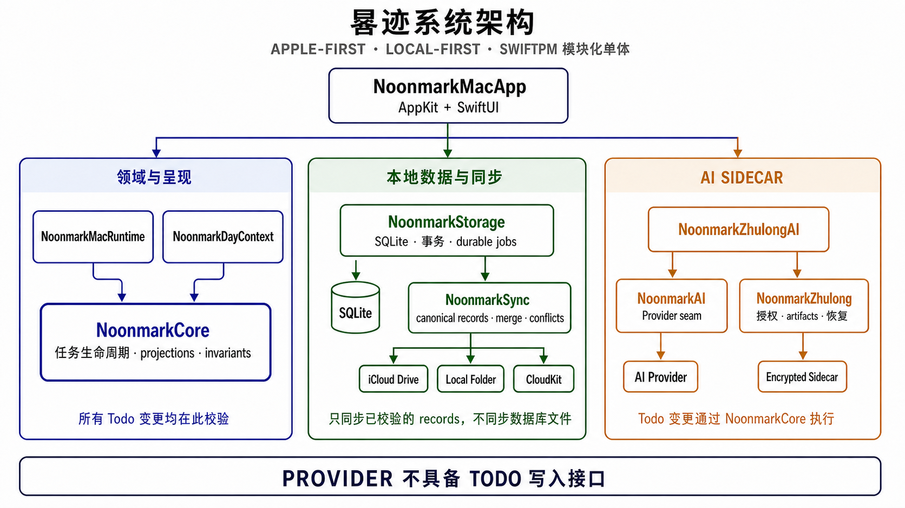

几个关键设计选择：

- **不是 event sourcing**：SQLite 保存关系事实与当前状态；append-only 流水用于历史、审计、同步和恢复。
- **不直接同步数据库文件**：同步层使用稳定 ID、canonical record、因果依赖、冲突和 durable pending。
- **历史与当前分类分开**：整理今天与未来不会重写历史任务的分组／标签快照。
- **Provider 没有 Todo 写接口**：AI artifact 最终仍通过 `NoonmarkCore` 的普通领域操作落地。
- **没有第三方 runtime package**：主要依赖 Apple 系统框架、CryptoKit、Security、CloudKit 和系统 `sqlite3`。

进一步阅读：

- [完整 As-built 系统设计](docs/design/noonmark-system-design.md)
- [领域语言与统一术语](CONTEXT.md)
- [Mac UI 设计契约](docs/design/mac-ui-design-contract.md)
- [产品范围](docs/product/phase-1-scope.md)与[功能规格](docs/product/phase-1-functional-spec.md)
- [测试、CI 与发布基线](docs/engineering/testing-ci-release.md)
- [交互式演示 fixture](docs/engineering/interactive-demo-fixture.md)
- [腾讯输入法输入性能与持久化门禁](docs/engineering/tencent-ime-input-performance.md)
- [架构决策记录](docs/adr/)
- [README 调研依据](docs/research/github-readme-product-presentation.md)

## 本地构建

### 环境要求

- macOS 14 或更新版本；
- 完整 Xcode，且 `xcrun --find xctest` 可用；
- Swift Package Manager，项目 manifest 使用 Swift Tools 6.0；
- 质量门禁另需 `swiftlint` 与 `swiftformat`。

当前构建脚本从 SwiftPM release/debug 产物组装 `.app`。在 Apple Silicon 开发机上默认输出 `arm64`，尚未生成 universal binary。

### 构建并打开 App

```bash
git clone git@github.com:quboliu/noonmark.git
cd noonmark

make build
make build-app
open dist/Noonmark.app
```

配置本机 Provider 后，可使用：

```bash
make run-app
```

### 启动固定一年演示

```bash
make run-demo-app
```

该入口会重建隔离目录 `artifacts/interactive-demo/`，生成含 365 个连续使用日的真实 SQLite、二十场加密烛龙会话、机器覆盖 manifest 和 README 同源截图，验证成功后保持 Demo App 打开。

> 开发数据警告：项目仍执行 pre-release clean cut。受控构建与测试入口会清除固定开发数据库、相关开发 App 状态和固定 iCloud 开发同步仓库，不迁移旧开发 schema。不要把开发入口指向需要保留的正式用户数据。

## 质量门禁

晷迹不以“Swift 能编译”代替用户路径验证。当前门禁按层次提供证据：

| 层次 | 入口 | 主要覆盖 |
| --- | --- | --- |
| Build + 静态质量 | `make check` | App icon、Swift build、SwiftLint、SwiftFormat、边界守卫与证据来源 |
| Unit | `make test-unit` | 领域状态机、纯函数、Provider contract |
| Integration | `make test-integration` | SQLite schema、repository、canonical 数据包、跨模块 round-trip |
| System | `make test-system` | 完整 SwiftPM test suite |
| Simulation | `make test-deterministic-sim` | 固定 seed、模型对账、生命周期不变量 |
| Demo fixture | `make test-demo-fixture` | 真实 `.app`、一年故事、SQLite、加密 sidecar 与截图契约 |
| Tencent IME contract | `make test-tencent-ime-input-contract` | 53 个输入面清单、性能阈值与回归组件静态门禁 |
| Tencent IME real App | `make test-tencent-ime-input-matrix` + `make test-tencent-ime-termination-persistence` | 真实腾讯拼音、年度负载、回显延迟、组合态、持久化与立即退出重启回读 |
| Real App E2E | `make test-e2e` | WindowServer 输入、原生窗口、用户交互、重启、SQLite 与日志 |
| DMG | `make package-dmg` | 完整私有发行链：签名、checksum、挂载、受控安装、启动、输入、持久化与重启 |
| Live Provider | `make test-ai-provider-live` | 显式凭证下的真实 Provider smoke；不进入默认门禁 |
| Live Cloud | `make test-cloudkit-sync-live` | 需要签名、entitlement 与隔离环境；缺依赖时 fail-closed |

`make check`、E2E、DMG 和安装验证都会留下带 source／binary identity 的运行证据，避免把旧日志或另一份二进制的结果归到当前提交。

---

<p align="center">
  <strong>晷迹不是把任务保存成一行文字，而是保存一项承诺如何穿过每一天。</strong>
</p>
