<p align="center">
  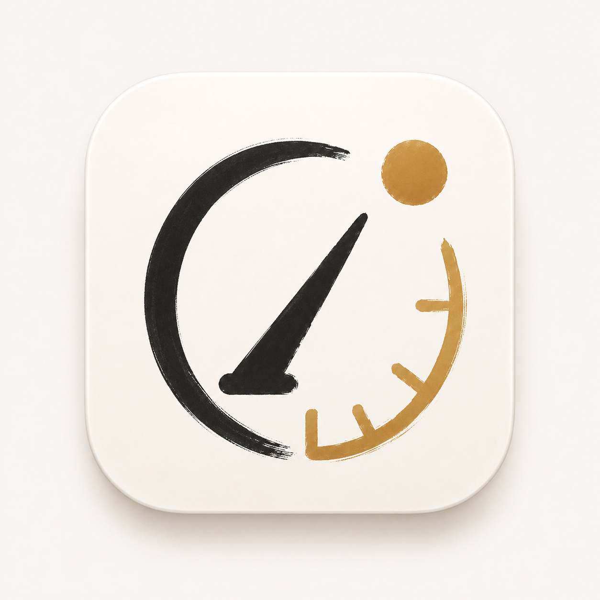
</p>

<h1 align="center">晷迹 · Noonmark</h1>

<p align="center">
  <strong>把任务的今天、来路与去向都留下来。</strong><br>
  面向 macOS 的原生、local-first 日任务系统，围绕 Day Todo、任务轨迹、每日复盘和可解释 AI 协作设计。
</p>

<p align="center">
  <a href="#产品导览">产品导览</a> ·
  <a href="#核心能力">核心能力</a> ·
  <a href="#系统设计">系统设计</a> ·
  <a href="#本地构建">本地构建</a> ·
  <a href="#质量门禁">质量门禁</a>
</p>

<p align="center">
  
  
  
  
  
</p>

<p align="center">
  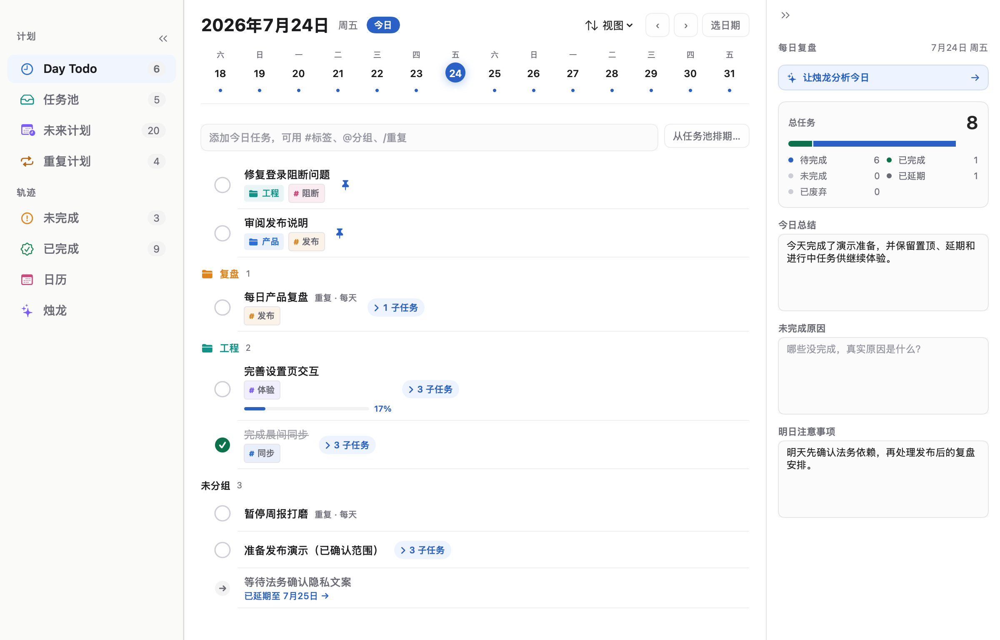
</p>

## 晷迹解决什么问题

普通 Todo 擅长回答“现在还有什么没打勾”，却很难如实回答：

- 星期一没完成、星期二继续后，星期一到底发生了什么；
- 主动延期、日终未完成、任务变更和回到任务池是否应该是同一种状态；
- 一项长期重复计划的规则、每天实例和历史完成情况怎样同时成立；
- AI 为什么读到这些任务、给出了什么建议，又真正改写了什么；
- 多设备交换数据时，怎样避免旧事实复活或静默覆盖当前状态。

晷迹把“当前计划”和“已经发生的事实”分开。`TaskChain` 记录同一件事的连续身份，`TaskDefinition` 记录当前描述与计划，`DayTrace` 记录某个自然日真实发生的结果。页面不是几张互不相干的清单，而是同一组领域事实的不同投影。

| 产品原则 | 在晷迹里的落点 |
| --- | --- |
| Day-first | 每个自然日都有独立 Day Todo、真实结果与每日复盘 |
| 历史不说谎 | 完成、未完成、延期、回池、变更和废弃保留不同语义 |
| 计划与执行分离 | 任务池、未来计划、重复计划与具体日实例各司其职 |
| 本地优先 | 核心 Todo 以本机 SQLite 为事实源，无账号、无网络也可工作 |
| 白盒 AI | 烛龙披露读取范围、接收方、产物、确认和应用回执 |
| 失败可见 | 数据、同步和 Provider 路径 fail-closed，不用静默成功掩盖问题 |

## 产品导览

以下画面全部来自同一个真实 `NoonmarkDemo.app`：固定十天用户故事通过正式领域接口重放，再由 SQLite 与加密烛龙 sidecar 回读对账。它们不是 HTML 原型，也不是为 README 手工拼出的静态 mock。

### 从捕获到排期

任务可以直接进入今天，也可以先留在任务池。标题输入支持 `#标签`、`@分组`，新任务可用 `/重复` 或 `/repeat` 进入重复计划配置。任务池保留说明与计划子任务，排期后才进入具体 Day Todo。

<table>
  <tr>
    <td width="50%">
      <strong>任务池</strong><br>
      尚未承诺日期的任务，以及不依赖 Provider 的本地统计。
    </td>
    <td width="50%">
      <strong>未来计划</strong><br>
      按日期查看普通计划与可见范围内的重复实例。
    </td>
  </tr>
  <tr>
    <td>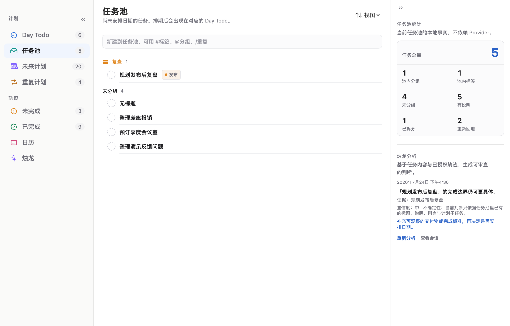</td>
    <td>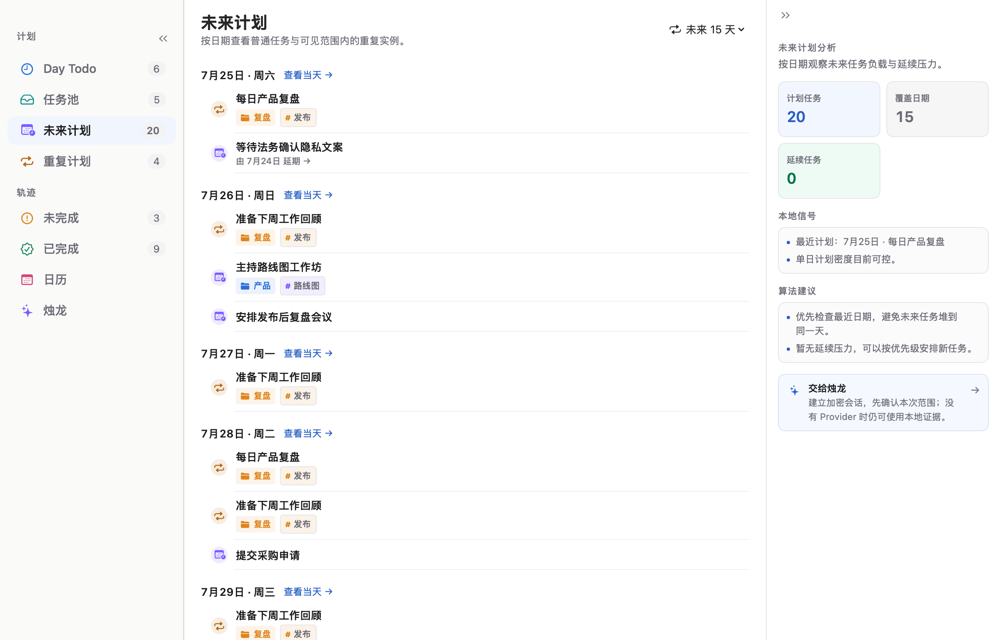</td>
  </tr>
</table>

### 重复计划是一等领域对象

重复计划不是在普通列表里无限复制同名任务。父计划集中管理标题、说明、分类、标签、子任务、开始日期、频率、结束条件和向前生效的规则修订；每个计划日仍然形成可独立完成、未完成、延期、跳过或废弃的实例。

进行中、即将开始、自然结束和提前停止拥有不同生命周期语义。完整轨迹按自然日呈现，不用“连续几天”这一项摘要替代真实打卡记录。

<p align="center">
  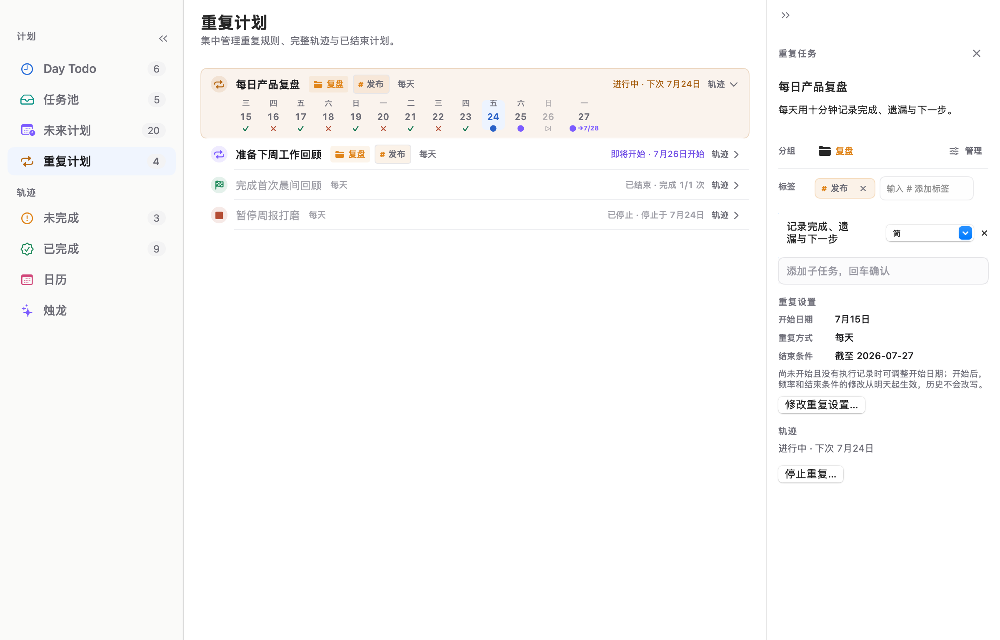
</p>

### 未完成与已完成都保留上下文

未完成池按任务链去重，用户可以查看历史原因并决定延续或废弃；已完成池按完成事实展示单日与跨日轨迹，并用缩进结构表达父子任务关系。两者都不是把历史压扁成一排无上下文标题。

<table>
  <tr>
    <td width="50%">
      <strong>未完成</strong><br>
      看清最近未完成日期、延续关系与当前处理状态。
    </td>
    <td width="50%">
      <strong>已完成</strong><br>
      保留完成时刻、跨日轨迹和父子任务层级。
    </td>
  </tr>
  <tr>
    <td>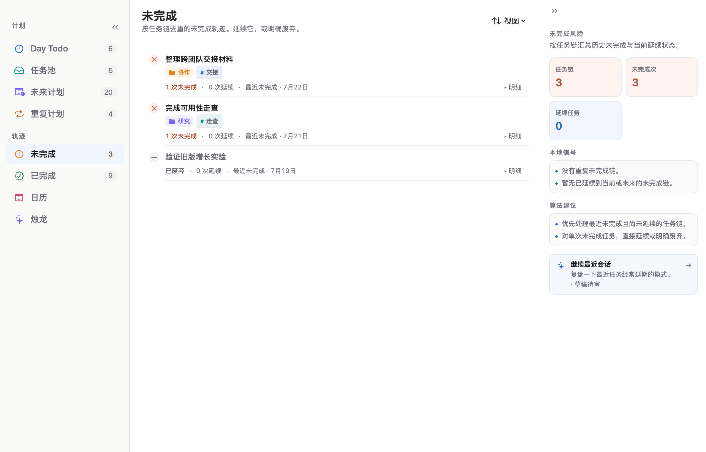</td>
    <td>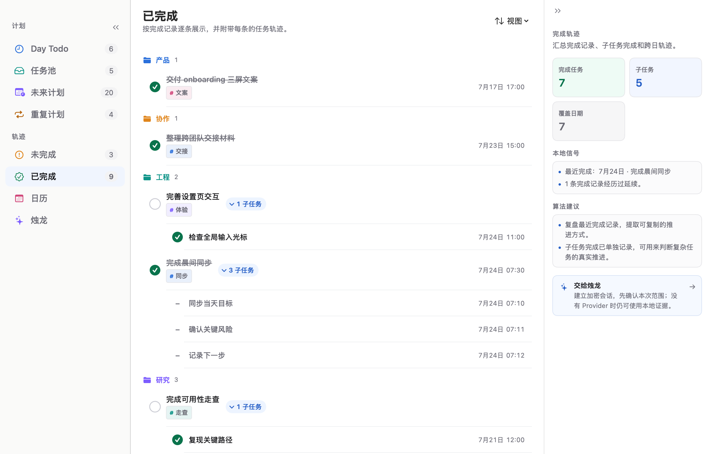</td>
  </tr>
</table>

### 月历是轨迹总览，不是另一套任务源

日历按月汇总普通任务的日期、状态和摘要；选择某一天后回到该日真实详情。重复计划的父项与管理轨迹留在“重复计划”，日历只承担普通日轨迹总览，避免跨模块重复计数。

<p align="center">
  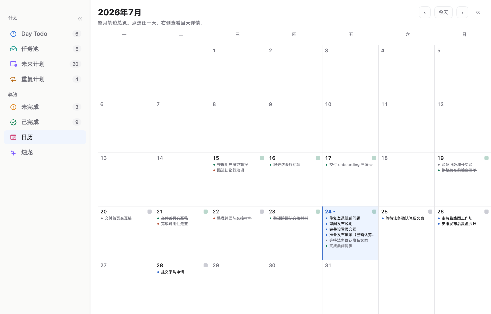
</p>

### 烛龙：会对话，但不绕过任务边界

烛龙可以协助任务成形、每日复盘、习惯洞察和任务池分析。Provider 只接收用户授权的范围；结构化产物先形成可审阅 artifact 与 Todo diff，再由用户确认后通过普通领域接口应用。唯一的窄自动写入例外是用户显式启用的新任务自动分组与标签，它由耐久 job、严格响应 contract 和过期 fences 约束。

没有 Provider 时，Day Todo、任务池、未来计划、重复计划、日历、数据包和本地统计仍然完整可用。

<p align="center">
  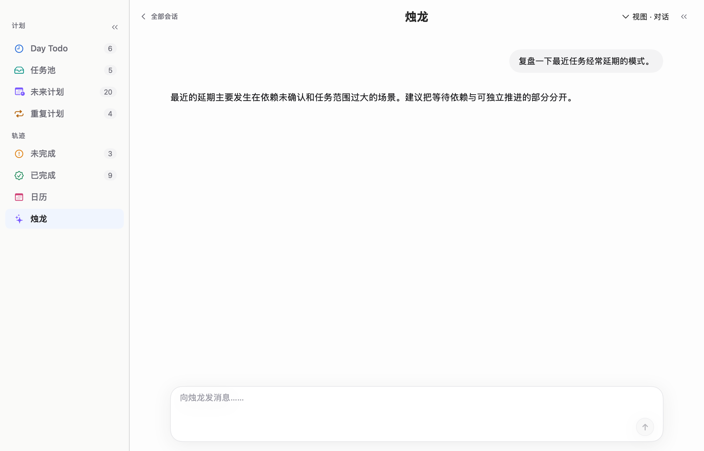
</p>

### 在任何 App 里快速记录

应用内使用 `⌘N`；晷迹进程运行时，还可以用默认 `⌃⇧N` 从其他 App 唤起独立 Quick Entry。全局组合可录制修改，注册失败时保留旧组合，并明确提示 macOS 无法枚举所有第三方 App 快捷键这一系统边界。

<p align="center">
  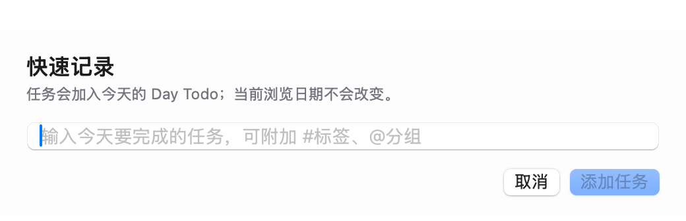
</p>

<details>
  <summary><strong>查看原生设置与数据边界截图</strong></summary>
  <br>
  <p><strong>偏好与全局快捷键</strong></p>
  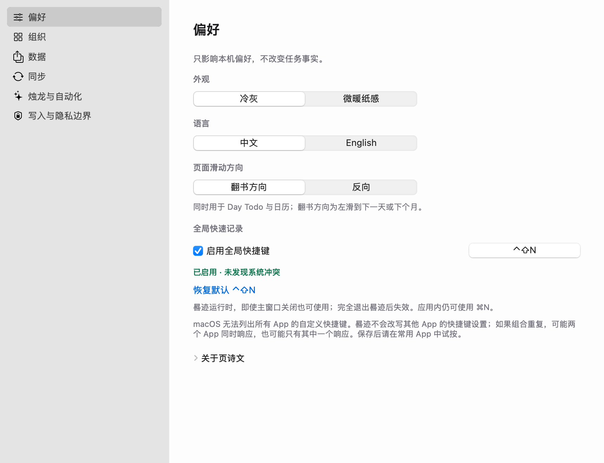
  <p><strong>分组与标签目录</strong></p>
  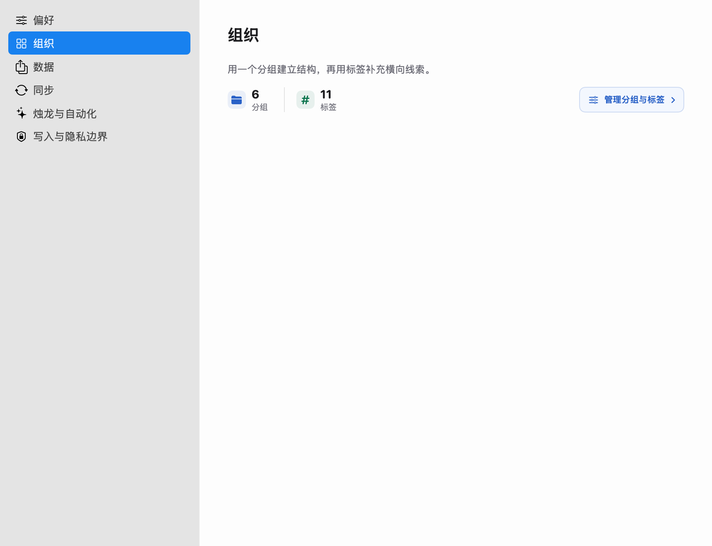
  <p><strong>事务性数据包</strong></p>
  
  <p><strong>写入与隐私边界</strong></p>
  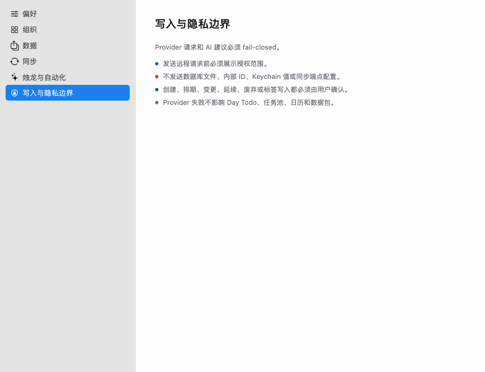
</details>

## 核心能力

| 领域 | 已实现能力 |
| --- | --- |
| Day Todo | 快速新增、置顶、完成、延期、回池、变更、废弃、进度、子任务、附言、每日复盘 |
| 任务池 | 未排期任务、说明、计划子任务、排期、分组视图、本地统计、grounded 烛龙分析 |
| 未来计划 | 普通任务改期、按日期聚合、重复实例 7／15／30 天可见范围 |
| 重复计划 | 四态生命周期、有限结束条件、向前修订、停止、跳过、完整逐日轨迹 |
| 历史池 | 未完成按任务链聚合；已完成保留时刻、轨迹和父子层级 |
| 分类 | 一个主分组、多标签、历史快照；任何任务状态都可整理当前分类 |
| 捕获与导航 | 应用内 `⌘N`、全局快捷键、原生菜单、搜索、日期键盘导航与滑动 |
| 数据 | SQLite、canonical JSON 数据包、写后回读、事务性导入与失败回滚 |
| 同步 | 显式启用的 iCloud Drive／本地文件夹逐记录同步、冲突与等待状态、真实任务变化计数、最近同步与最近有效同步时间 |
| AI | OpenAI-compatible／本地／自定义 HTTP Provider seam、连接测试、流式会话、结构化产物、授权与回执 |
| 国际化与外观 | 中文／English、冷灰／微暖纸感、macOS 原生亮色界面 |

> 同步边界：S3 与 WebDAV 目前仍是规划中的端点；CloudKit `CKSyncEngine` adapter 已有实现边界，但在 provisioning、Production schema 和双物理设备 live 门禁完成前不作为默认用户路径。当前可用的 Apple 云路径是显式启用的 iCloud Drive 逐记录仓库。

## 数据、隐私与 AI 边界

| 数据层 | 保存位置与保护 | 默认边界 |
| --- | --- | --- |
| 核心 Todo 事实 | 本机 SQLite | local-first 主事实源；不依赖 Provider |
| Provider API Key | macOS Keychain | 不进入 SQLite、数据包或同步记录 |
| 烛龙会话与产物 | 独立 AES-GCM 加密 sidecar | 普通 Todo 数据包与同步不包含 sidecar |
| 数据包 | canonical JSON + SHA-256 回读校验 | 文件本身不加密；导入时事务性替换并保持同步关闭 |
| 同步仓库 | 逐条 canonical `SyncRecord` | 不复制 SQLite／WAL／SHM；合并前按不可信输入校验 |
| Provider 请求 | 用户授权的最小 scope | 不发送数据库文件、内部 ID、Keychain 值或同步端点配置 |

AI 的读取授权、远程发送授权和 Todo 写入授权彼此分离。接收方、范围或 endpoint 实质变化会触发重新确认；Provider 失败不会阻断普通清单，错误也不能被记录成成功。

## 系统设计

晷迹是 Apple-first 的 SwiftPM 模块化单体：AppKit 管理应用生命周期、窗口、菜单和全局快捷键，SwiftUI 构建页面与设置；领域、持久化、同步和 AI 通过独立 target 隔离。

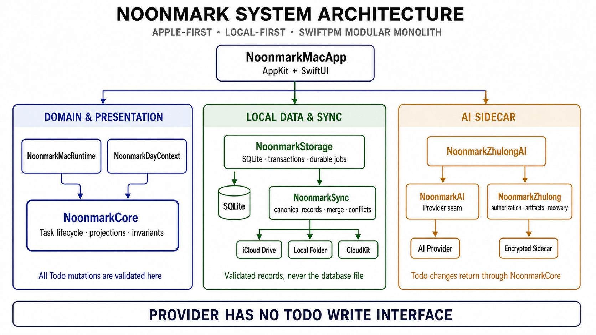

几个关键设计选择：

- **不是 event sourcing**：SQLite 保存关系事实与当前状态；append-only 流水用于历史、审计、同步和恢复。
- **不直接同步数据库文件**：同步层使用稳定 ID、canonical record、因果依赖、冲突和 durable pending。
- **历史与当前分类分开**：整理今天与未来不会重写历史任务的分组／标签快照。
- **Provider 没有 Todo 写接口**：AI artifact 最终仍通过 `NoonmarkCore` 的普通领域操作落地。
- **没有第三方 runtime package**：主要依赖 Apple 系统框架、CryptoKit、Security、CloudKit 和系统 `sqlite3`。

进一步阅读：

- [完整 As-built 系统设计](docs/design/noonmark-system-design.md)
- [领域语言与统一术语](CONTEXT.md)
- [Mac UI 设计契约](docs/design/mac-ui-design-contract.md)
- [产品范围](docs/product/phase-1-scope.md)与[功能规格](docs/product/phase-1-functional-spec.md)
- [测试、CI 与发布基线](docs/engineering/testing-ci-release.md)
- [交互式演示 fixture](docs/engineering/interactive-demo-fixture.md)
- [架构决策记录](docs/adr/)
- [README 调研依据](docs/research/github-readme-product-presentation.md)

## 本地构建

### 环境要求

- macOS 14 或更新版本；
- 完整 Xcode，且 `xcrun --find xctest` 可用；
- Swift Package Manager，项目 manifest 使用 Swift Tools 6.0；
- 质量门禁另需 `swiftlint` 与 `swiftformat`。

当前构建脚本从 SwiftPM release/debug 产物组装 `.app`。在 Apple Silicon 开发机上默认输出 `arm64`，尚未生成 universal binary。

### 构建并打开 App

```bash
git clone git@github.com:quboliu/noonmark.git
cd noonmark

make build
make build-app
open dist/Noonmark.app
```

配置本机 Provider 后，可使用：

```bash
make run-app
```

### 启动固定十天演示

```bash
make run-demo-app
```

该入口会重建隔离目录 `artifacts/interactive-demo/`，生成真实 SQLite、五场加密烛龙会话、机器覆盖 manifest 和 README 同源截图，验证成功后保持 Demo App 打开。

> 开发数据警告：项目仍执行 pre-release clean cut。受控构建与测试入口会清除固定开发数据库、相关开发 App 状态和固定 iCloud 开发同步仓库，不迁移旧开发 schema。不要把开发入口指向需要保留的正式用户数据。

## 质量门禁

晷迹不以“Swift 能编译”代替用户路径验证。当前门禁按层次提供证据：

| 层次 | 入口 | 主要覆盖 |
| --- | --- | --- |
| Build + 静态质量 | `make check` | App icon、Swift build、SwiftLint、SwiftFormat、边界守卫与证据来源 |
| Unit | `make test-unit` | 领域状态机、纯函数、Provider contract |
| Integration | `make test-integration` | SQLite schema、repository、canonical 数据包、跨模块 round-trip |
| System | `make test-system` | 完整 SwiftPM test suite |
| Simulation | `make test-deterministic-sim` | 固定 seed、模型对账、生命周期不变量 |
| Demo fixture | `make test-demo-fixture` | 真实 `.app`、十天故事、SQLite、加密 sidecar 与截图契约 |
| Real App E2E | `make test-e2e` | WindowServer 输入、原生窗口、用户交互、重启、SQLite 与日志 |
| DMG | `make package-dmg` + `make test-dmg-install` | 签名、checksum、挂载、复制安装、启动、输入、持久化与重启 |
| Live Provider | `make test-ai-provider-live` | 显式凭证下的真实 Provider smoke；不进入默认门禁 |
| Live Cloud | `make test-cloudkit-sync-live` | 需要签名、entitlement 与隔离环境；缺依赖时 fail-closed |

`make check`、E2E、DMG 和安装验证都会留下带 source／binary identity 的运行证据，避免把旧日志或另一份二进制的结果归到当前提交。

## 发布状态

`v1.0` 是当前源码与产品能力的 **source milestone**，不是一个已经面向公众完成公证的下载发行版。

- 可以从源码构建原生 `.app`；
- 可以生成 Apple Development 签名的验证 DMG，并完成真实复制安装与重启回读；
- 公开分发仍需 Developer ID Application、Hardened Runtime、secure timestamp、Apple notarization、staple 与 Gatekeeper 验收；
- 在这些门禁完成前，仓库不会把开发签名 DMG 伪装成公开下载包。

当前仓库尚未声明开源许可证。复制、再分发或衍生使用须以仓库所有者的明确授权为准。

---

<p align="center">
  <strong>晷迹不是把任务保存成一行文字，而是保存一项承诺如何穿过每一天。</strong>
</p>
