<p align="center">
  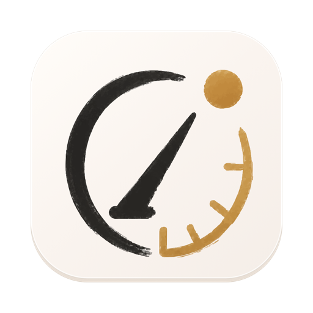
</p>

<h1 align="center">Noonmark · 晷迹</h1>

<p align="center">
  <strong>Keep what a task promised, what actually happened, and where it goes next.</strong><br>
  A native, local-first daily task system for macOS, built around Day Todo, task traces, Flylight quick notes, daily reviews, and explainable AI collaboration.
</p>

<p align="center">
  <strong>English</strong> ·
  <a href="README.zh-CN.md">简体中文</a>
</p>

<p align="center">
  <a href="#product-tour">Product tour</a> ·
  <a href="#core-capabilities">Core capabilities</a> ·
  <a href="#system-design">System design</a> ·
  <a href="#build-locally">Build locally</a> ·
  <a href="#quality-gates">Quality gates</a>
</p>

<p align="center">
  
  
  
  
  <a href="LICENSE"></a>
</p>

## The problem Noonmark solves

Ordinary todo lists are good at answering "what is still unchecked right now", but struggle to answer honestly:

- what actually happened on Monday when an unfinished task continued into Tuesday;
- whether a deliberate deferral, an end-of-day miss, an edit, and a return to the pool should all be the same state;
- how a long-running recurring plan's rule, its daily instances, and its history can all hold at once;
- why the AI read these tasks, what it suggested, and what it actually changed;
- how devices exchange data without resurrecting old facts or silently overwriting current state.

Noonmark separates "the current plan" from "facts that already happened". A `TaskChain` keeps the continuous identity of one piece of work, a `TaskDefinition` holds its current description and plan, and a `DayTrace` records what really happened on a given calendar day. The pages are not disconnected lists — they are different projections of the same domain facts.

| Product principle | Where it lands in Noonmark |
| --- | --- |
| Day-first | Every calendar day gets its own Day Todo, real outcomes, and a daily review |
| History does not lie | Completed, unfinished, deferred, returned-to-pool, edited, and dropped keep distinct semantics |
| Plan and execution stay separate | Task pool, upcoming plans, recurring plans, and concrete day instances each do their own job |
| Local-first | The core todo truth lives in on-device SQLite; no account or network required |
| Glass-box AI | Zhulong discloses read scope, recipient, artifacts, confirmation, and application receipts |
| Failures stay visible | Data, sync, and Provider paths fail closed instead of masking problems with silent success |

## Product tour

Every screen below comes from the same real `NoonmarkDemo.app`: a fixed one-year user story replayed through the official domain interfaces, then reconciled by reading back SQLite and the encrypted Zhulong sidecar. These are not HTML prototypes, and not static mocks assembled by hand for the README.

The ten primary surfaces of the main workspace — Plan (Day Todo, Task Pool, Upcoming, Recurring Plans), Trace (Unfinished, Completed, Calendar, Zhulong), and Memo (Sticky Note, Flylight) — plus Quick Entry and the four settings panes that carry no host identity are all shown in full below. The Sync and Zhulong Provider panes can contain local paths or Provider identity, so they never become reusable documentation screenshots and remain covered by dedicated real-app E2E.

### Plan and execution

#### Day Todo: one day's plan and outcome

Date navigation, quick input, the pinned queue, grouped tasks, recurring instances, and the day's outcome all live on the same day trace. The daily review on the right shows completion rate, the last seven days, local signals, a summary, and unfinished reasons — no switching to a separate data view.

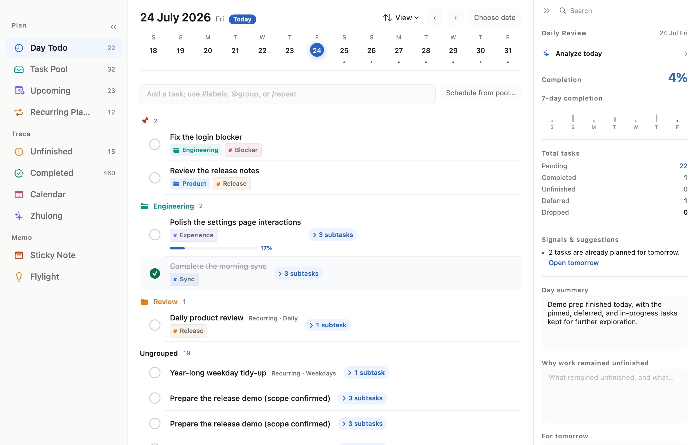

#### Task Pool: capture first, decide the date later

A task can go straight into today or stay in the pool first. Title input supports `#labels` and `@group`, and `/repeat` opens recurring plan configuration. The pool organizes unscheduled work by group, with Provider-independent local statistics on the right; grounded, reviewable Zhulong analysis appears only when a Provider is ready.

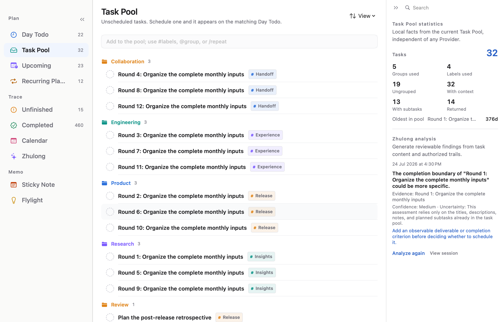

#### Upcoming: commitments and load by date

Ordinary tasks and recurring instances merge by date while keeping their own classification and origin. Recurring instances can switch between 7, 15, and 30-day visibility; the right rail summarizes covered dates, the heaviest day, local signals, and actionable suggestions.

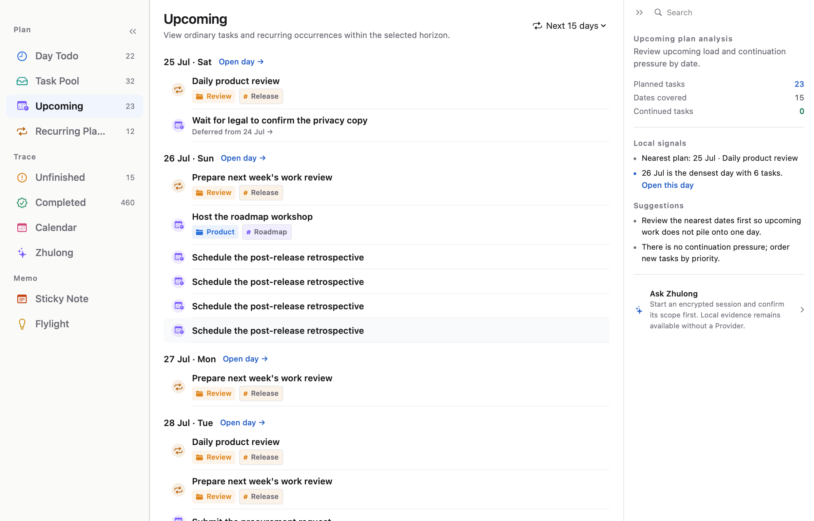

#### Recurring Plans: rules stay apart from daily facts

A recurring plan is not the same task copied forever in a flat list. The parent plan manages title, notes, classification, labels, subtasks, start date, frequency, end conditions, and forward-only revisions; each plan day still forms its own instance that can be completed, missed, deferred, skipped, or dropped.

Active, upcoming, naturally ended, and stopped early are distinct lifecycle semantics. Expand a track to inspect what happened day by day instead of trusting a single "several days in a row" summary.

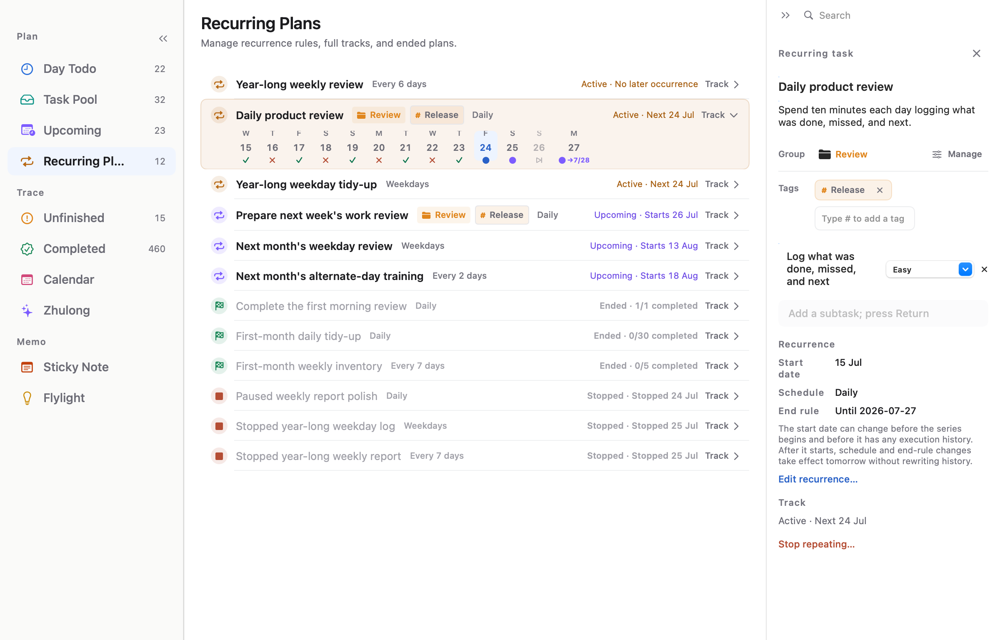

### Trace and review

#### Unfinished: see where a task has been before continuing it

The unfinished pool deduplicates by task chain and shows miss counts, continuation counts, and the most recent missed date directly. Expand the detail before deciding to continue or explicitly drop; the right rail aggregates repeat risk, local signals, and suggested handling.

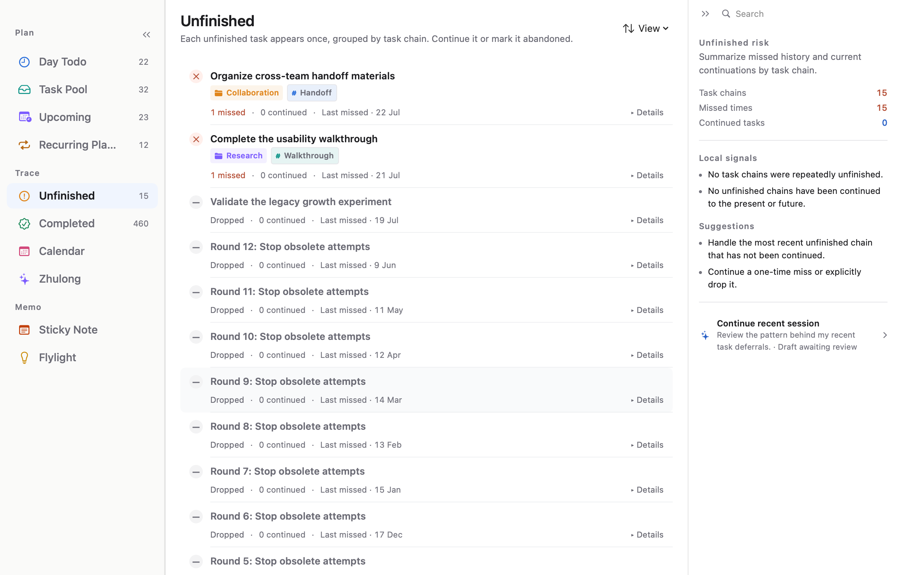

#### Completed: hierarchy and cross-day traces preserved

The completed pool shows single-day and cross-day traces as completion facts, with indentation expressing parent-child structure. Partial and full completion use different parent-child levels; completion times and copyable progress paths are not flattened into a row of titles.

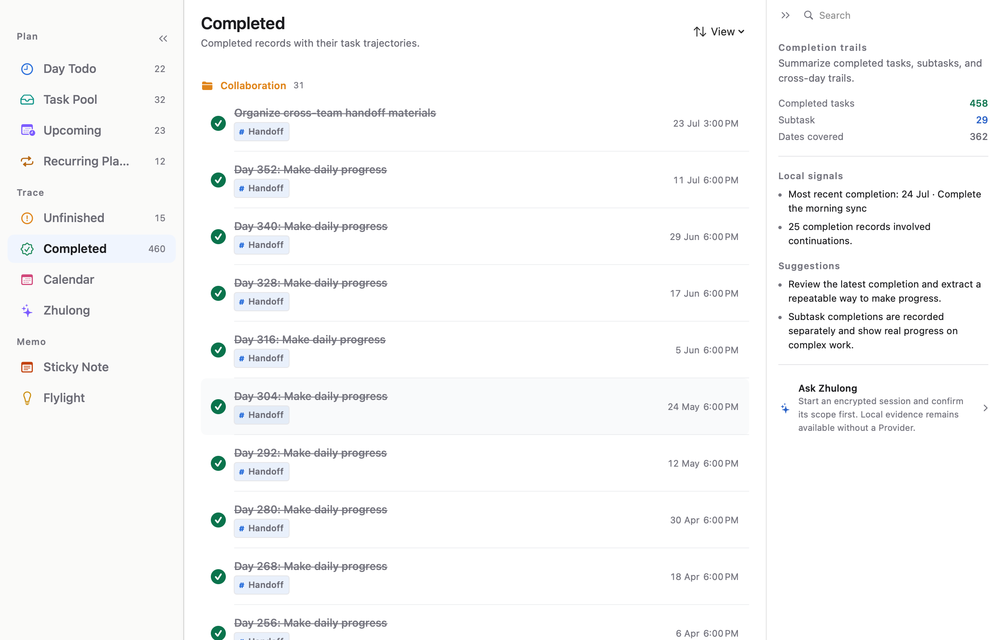

#### Calendar: a month of ordinary task traces

The calendar aggregates ordinary tasks by month with dates, states, and summaries; selecting a day returns to that day's real Day Todo. Recurring parents and their management tracks stay in Recurring Plans — the calendar only owns the ordinary day-trace overview, avoiding double counting across modules.

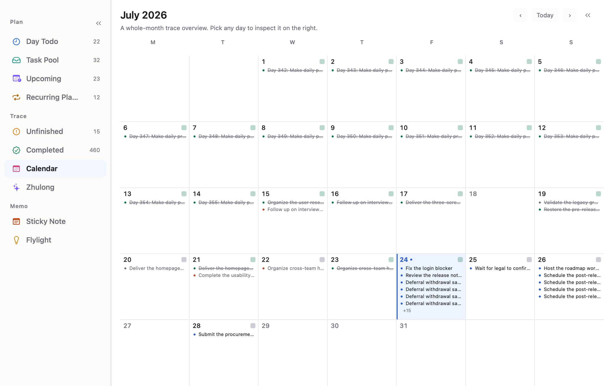

### Memo: Flylight and Sticky Note

#### Flylight: write it down first, decide where it belongs later

Flylight is a note-first source library for sparks, reminders, and fragments you have not yet decided whether or how to execute. The composer at the top supports multi-line Markdown with `#label` and `@group` classification, and drafts survive closing and restart. The timeline runs newest-first, grouped by calendar day; double-click any old entry to edit it in place. Search, group/label filters, and Review are mutually exclusive primary sets, not stacked list sections. Flylight never enters any task state machine and does not depend on an AI Provider.

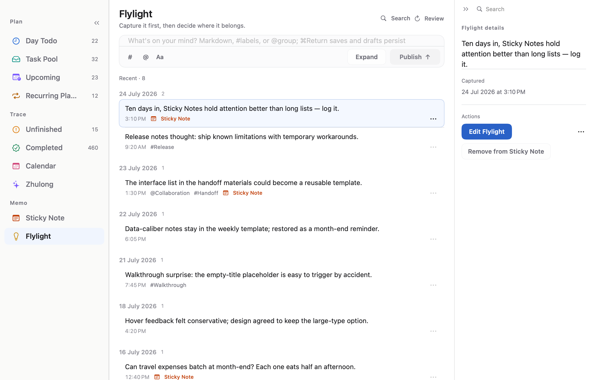

Double-click any old Flylight to rewrite its body in place — save and cancel both happen where the entry sits, without leaving the timeline context.

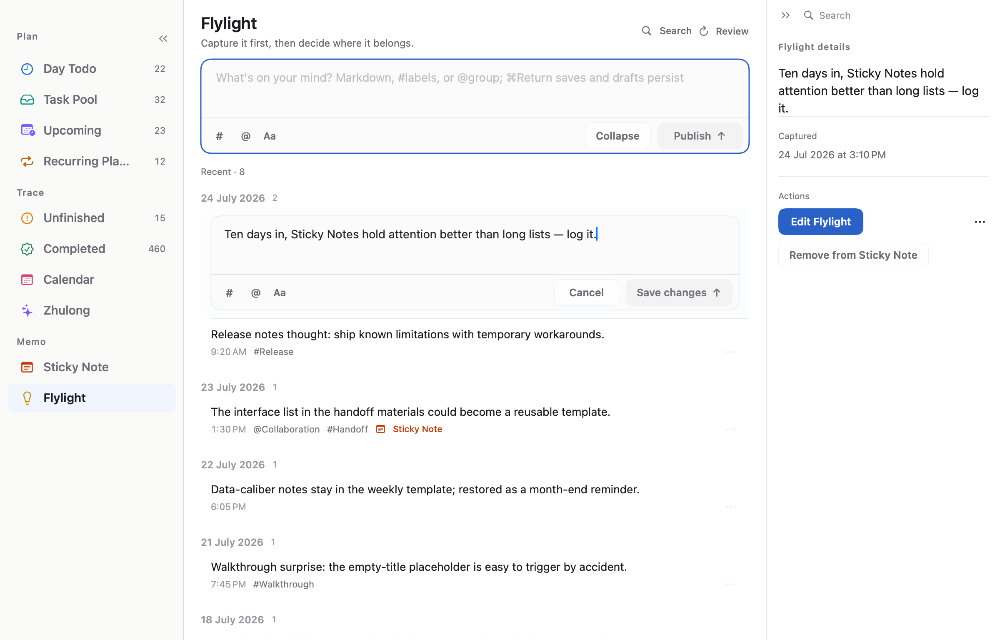

#### Sticky Note: pin the Flylights worth seeing again

Sticky Note is a curated projection of Flylight entries, not a copy: pinning duplicates neither body nor creation time, editing the source Flylight updates every view immediately, and deleting the source removes it from the curated set automatically. The page offers a note wall and a stream layout; the view choice is a device-local preference that never enters data packages or sync.

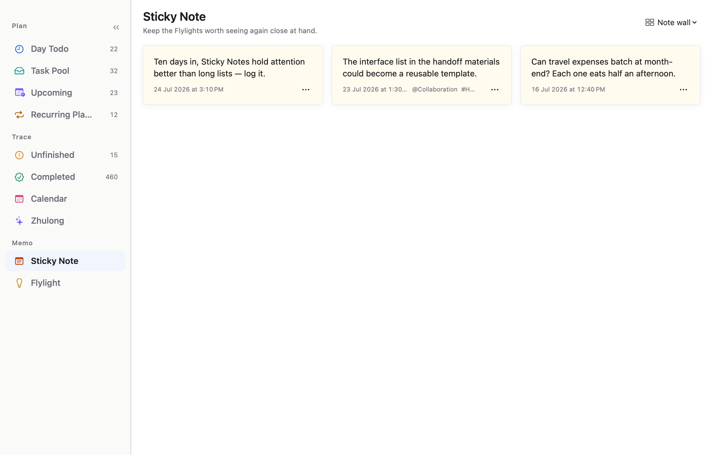

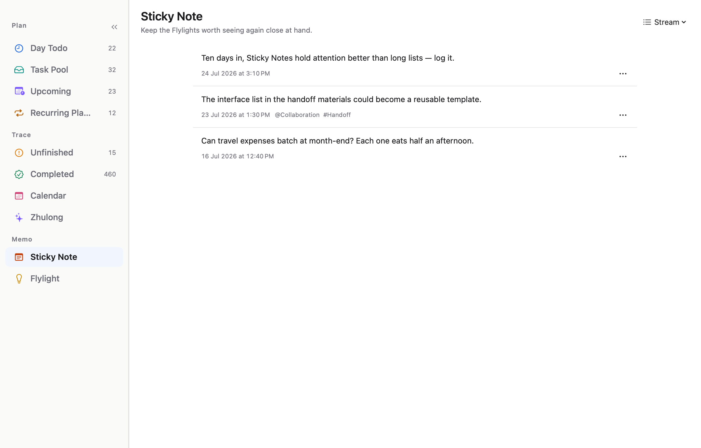

### Explainable AI collaboration

#### Zhulong: conversational, but never around the task boundary

Zhulong can help shape tasks, run daily reviews, surface habit insights, and analyze the task pool. A Provider only receives the scopes the user authorizes; structured output first becomes a reviewable artifact and Todo diff, then lands through ordinary domain interfaces after user confirmation. The single narrow automatic-write exception is opt-in auto grouping and labeling for new tasks, constrained by durable jobs, a strict response contract, and expiry fences.

Without a Provider, Day Todo, Task Pool, Upcoming, Recurring Plans, Calendar, data packages, and local statistics remain fully usable.

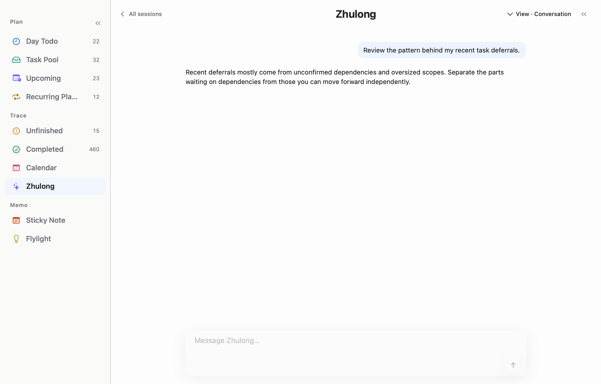

### Capture, organization, and data boundaries

#### Quick capture from any app

Inside the app, use `⌘N`; while Noonmark is running, the default `⌃⇧N` summons a standalone Quick Entry from any other app. The global combination can be re-recorded, registration failure keeps the old one, and the app states plainly that macOS cannot enumerate every third-party app's shortcuts.

<p align="center">
  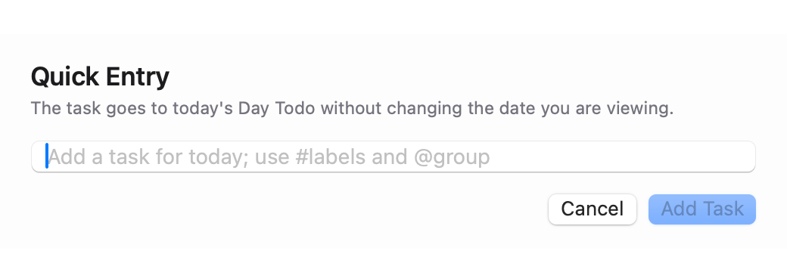
</p>

Flylight has its own global capture window (default `⌃⇧I`, rebindable in Settings), sharing one persistent composer session with the Flylight page composer: `Enter` for a newline, `⌘Enter` to save, `Esc` to close — drafts survive closing and restarts.

<p align="center">
  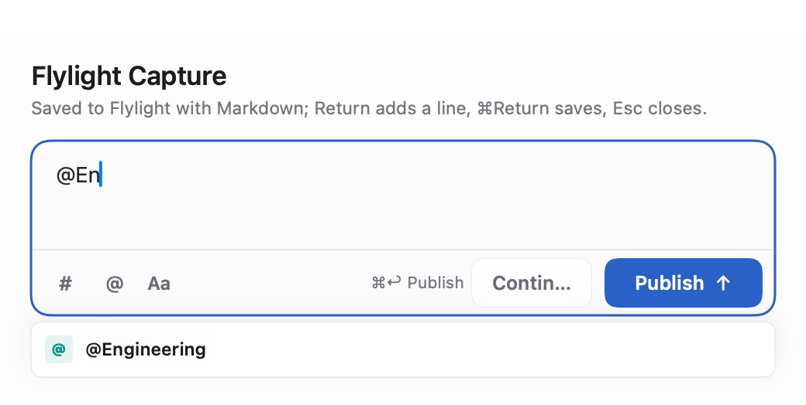
</p>

#### Preferences and global shortcuts

Preferences centralize the light appearance, Chinese/English, the swipe direction shared by Day Todo and Calendar, the global Quick Entry combination, and an optional settings-page verse.

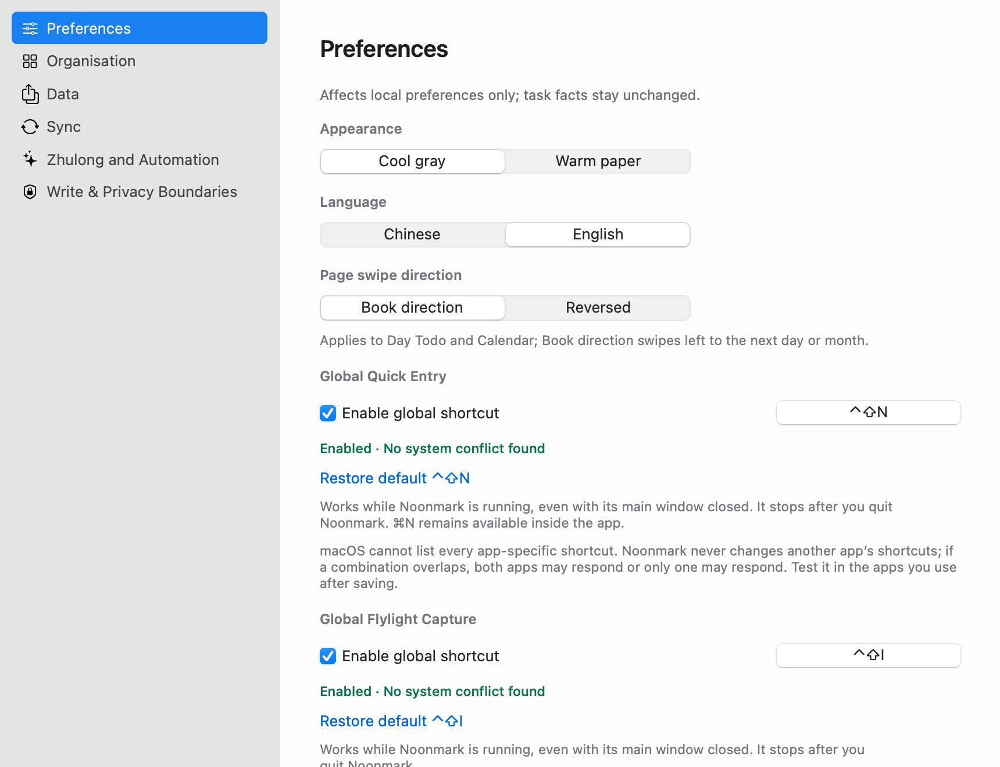

#### Group and label catalog

One primary group builds stable structure; multiple labels add cross-cutting threads. Organization settings show the current catalog size and lead into the unified group and label management surface.

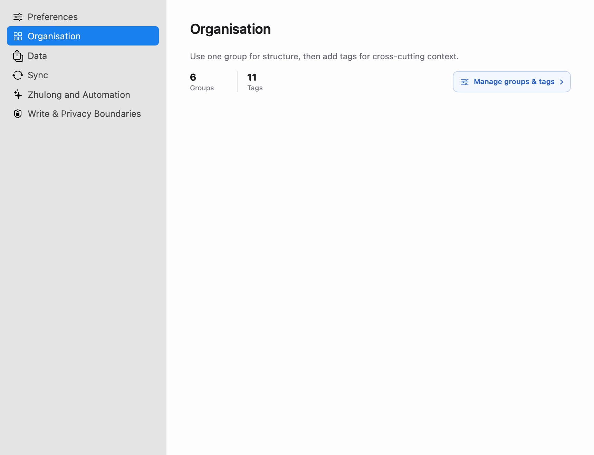

#### Transactional data packages

Data settings export and import complete task facts as canonical JSON packages. Import validates first, then replaces transactionally — a failure rolls back instead of leaving half a dataset in the current database.

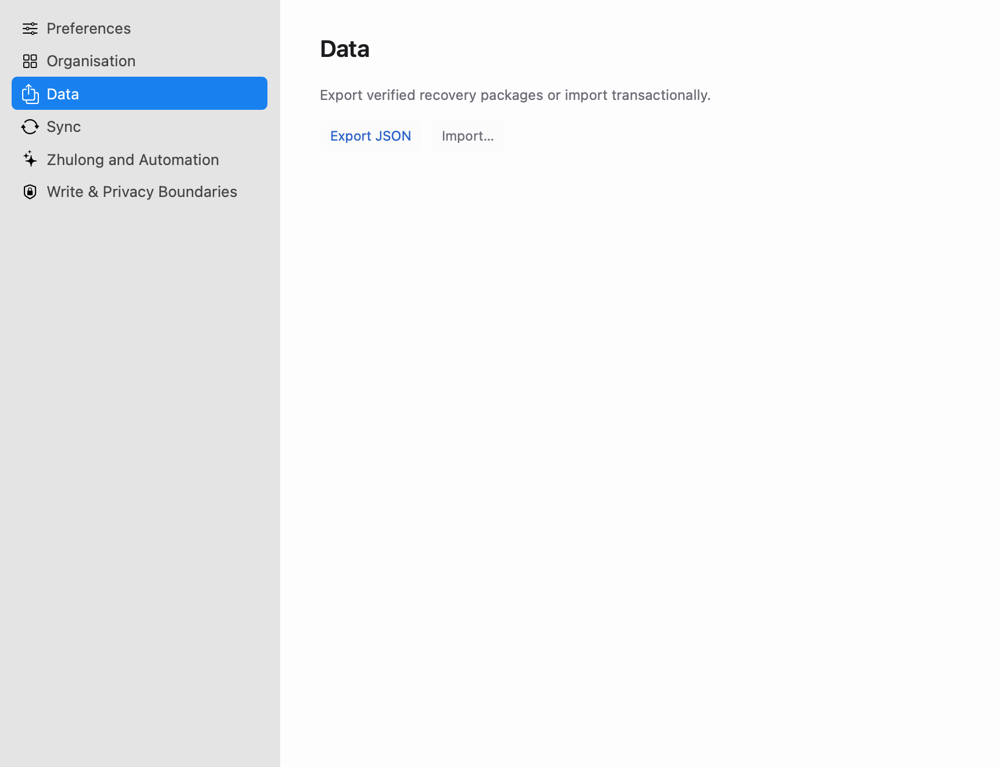

#### Write and privacy boundaries

Privacy settings spell out Provider requests, remote send scopes, Todo write confirmation, and failure behavior. The API Key stays in Keychain; database files, internal IDs, and sync endpoint configuration are never sent to a Provider.

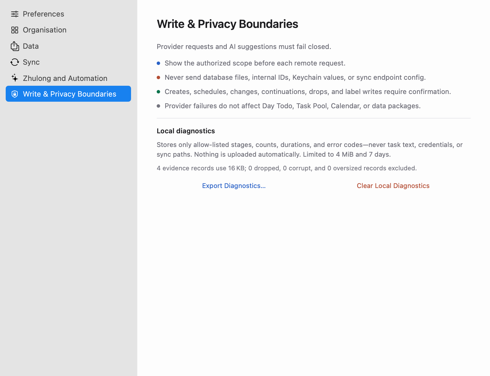

## Core capabilities

| Area | Delivered capabilities |
| --- | --- |
| Day Todo | Quick add, pin, complete, defer, return to pool, edit, drop, progress, subtasks, notes, daily review |
| Task Pool | Unscheduled tasks, descriptions, planned subtasks, scheduling, grouped view, local statistics, grounded Zhulong analysis |
| Upcoming | Reschedule ordinary tasks, aggregate by date, 7/15/30-day recurring instance visibility |
| Recurring Plans | Four lifecycle states, finite end conditions, forward-only revisions, stop, skip, complete day-by-day tracks |
| History pools | Unfinished aggregated by task chain; Completed keeps timestamps, traces, and parent-child hierarchy |
| Flylight | Markdown quick capture, persistent multi-line drafts, double-click inline edit, search, group/label filters, Review, hidden tombstones |
| Sticky Note | Curated Flylight projection, stream and wall views, instant edit sync, automatic removal on source delete |
| Classification | One primary group, multiple labels, historical snapshots; any task state can reclassify the present |
| Capture and navigation | In-app `⌘N`, global task capture `⌃⇧N`, global Flylight capture `⌃⇧I`, native menus, search, keyboard date navigation and swipes |
| Data | SQLite, canonical JSON packages, read-after-write verification, transactional import with rollback |
| Diagnostics | Bounded on-device diagnostics (4 MiB / 7 days), MetricKit summaries, privacy filtering, user-initiated `.noonmarkdiagnostics` export (8 MiB hard cap per package) |
| Sync | Explicitly enabled iCloud Drive / local-folder incremental batches, upload confirmation, conflict and waiting states, real task change counts, last-sync and last-good-sync times |
| AI | OpenAI-compatible / local / custom HTTP Provider seam, connection test, streaming sessions, structured artifacts, authorization and receipts |
| i18n and appearance | Chinese / English, cool gray / warm paper, native light-mode macOS UI |

> Sync boundary: S3 and WebDAV remain planned endpoints; the CloudKit `CKSyncEngine` adapter has an implementation boundary but is not a default user path until provisioning, the Production schema, and a dual-device live gate are complete. The Apple cloud path available today is the explicitly enabled iCloud Drive incremental repository built from immutable batches, per-producer heads, and durable frontiers.

## Data, privacy, and AI boundaries

| Data layer | Where it lives and how it is protected | Default boundary |
| --- | --- | --- |
| Core todo facts | On-device SQLite | local-first source of truth; never depends on a Provider |
| Provider API Key | macOS Keychain | Never enters SQLite, data packages, or sync records |
| Zhulong sessions and artifacts | Separate AES-GCM encrypted sidecar | Ordinary todo packages and sync exclude the sidecar |
| On-device diagnostics | Bounded strongly typed records, 4 MiB / 7-day hard caps | No task bodies, paths, endpoints, prompts/responses, or credentials; export is user-initiated |
| Data packages | Canonical JSON + SHA-256 read-back verification | Files are unencrypted; import replaces transactionally with sync held off |
| Sync repository | Per-record canonical `SyncRecord`s | Never copies SQLite/WAL/SHM; records validated as untrusted input before merge |
| Provider requests | Minimal user-authorized scopes | Never sends database files, internal IDs, Keychain values, or sync endpoint configuration |

Read authorization, remote-send authorization, and Todo write authorization for AI are separate. A material change of recipient, scope, or endpoint triggers re-confirmation; Provider failures never block ordinary lists, and errors cannot be recorded as success.

## System design

Noonmark is an Apple-first SwiftPM modular monolith: AppKit owns the application lifecycle, windows, menus, and global shortcuts, while SwiftUI builds the pages and settings; domain, persistence, sync, and AI are isolated in independent targets.


A few key design choices:

- **Not event sourcing**: SQLite holds relational facts and current state; the append-only journal serves history, audit, sync, and recovery.
- **The database file is never synced directly**: the sync layer uses stable IDs, canonical records, causal dependencies, conflicts, and durable pending state.
- **History and current classification stay separate**: reorganizing today and tomorrow never rewrites the group/label snapshots of historical tasks.
- **Providers have no Todo write interface**: AI artifacts still land through the ordinary domain operations of `NoonmarkCore`.
- **No third-party runtime packages**: the app relies on Apple system frameworks, CryptoKit, Security, CloudKit, and the system `sqlite3`.

Further reading (Chinese):

- [Complete as-built system design](docs/design/noonmark-system-design.md)
- [Domain language and unified terminology](CONTEXT.md)
- [Mac UI design contract](docs/design/mac-ui-design-contract.md)
- [Product scope](docs/product/phase-1-scope.md) and [functional spec](docs/product/phase-1-functional-spec.md)
- [Testing, CI, and release baseline](docs/engineering/testing-ci-release.md)
- [Interactive demo fixture](docs/engineering/interactive-demo-fixture.md)
- [Tencent IME input performance and persistence gates](docs/engineering/tencent-ime-input-performance.md)
- [Architecture decision records](docs/adr/)
- [README research notes](docs/research/github-readme-product-presentation.md)

## Build locally

### Requirements

- macOS 14 or later;
- a full Xcode installation with `xcrun --find xctest` available;
- Swift Package Manager — the project manifest uses Swift Tools 6.0;
- `swiftlint` and `swiftformat` for the quality gates.

The current build scripts assemble the `.app` from SwiftPM release/debug products. On Apple Silicon development machines they produce `arm64`; no universal binary yet.

### Build and open the app

```bash
git clone git@github.com:quboliu/noonmark.git
cd noonmark

make build
make build-app
open dist/Noonmark.app
```

With a local Provider configured, you can also:

```bash
make run-app
```

### Launch the fixed one-year demo

```bash
make run-demo-app
```

This entry rebuilds the isolated `artifacts/interactive-demo/` directory, replays 365 consecutive days of use into a real SQLite database with twenty encrypted Zhulong sessions, produces a machine-checkable coverage manifest and the same screenshots used in this README, and leaves the Demo app open once verification passes.

> Development data warning: the project still enforces a pre-release clean cut. Controlled build and test entries wipe the fixed development database, related development app state, and the fixed iCloud development sync repository without migrating old development schemas. Never point a development entry at production user data you want to keep.

## Quality gates

Noonmark does not substitute "Swift compiles" for user-path verification. The current gates provide layered evidence:

| Layer | Entry | Main coverage |
| --- | --- | --- |
| Build + static quality | `make check` | App icon, Swift build, SwiftLint, SwiftFormat, boundary guards and evidence provenance |
| Unit | `make test-unit` | Domain state machines, pure functions, Provider contracts |
| Integration | `make test-integration` | SQLite schema, repositories, canonical packages, cross-module round-trips |
| System | `make test-system` | The full SwiftPM test suite |
| Simulation | `make test-deterministic-sim` | Fixed seeds, model reconciliation, lifecycle invariants |
| Demo fixture | `make test-demo-fixture` | Real `.app`, one-year story, SQLite, encrypted sidecar, and screenshot contract |
| Tencent IME contract | `make test-tencent-ime-input-contract` | 53 input surfaces, performance thresholds, and regression component static gates |
| Tencent IME real app | `make test-tencent-ime-input-matrix` + `make test-tencent-ime-termination-persistence` | Real Tencent Pinyin, annual load, echo latency, composition states, persistence, and quit-restart read-back |
| Real App E2E | `make test-e2e` | WindowServer input, native windows, user interaction, restarts, SQLite, and logs |
| DMG | `make package-dmg` | The full private release chain: signing, checksums, mounting, controlled install, launch, input, persistence, and restart |
| Live Provider | `make test-ai-provider-live` | Real Provider smoke with explicit credentials; not part of the default gates |
| Live Cloud | `make test-cloudkit-sync-live` | Requires signing, entitlements, and an isolated environment; fails closed when dependencies are missing |

`make check`, E2E, DMG, and install verification all leave runtime evidence stamped with source/binary identity, so results from stale logs or a different binary cannot be attributed to the current commit.

## License

Noonmark is open source under the [GNU Affero General Public License v3.0](LICENSE) (AGPL-3.0). You are free to use, modify, and redistribute the code in this repository, but derivative works — including network services built on this code — must be open sourced under the same license. The copyright holder reserves the right to offer commercial licensing separately.

---

<p align="center">
  <strong>Noonmark does not save a task as a line of text — it saves how a promise travels through each day.</strong>
</p>
